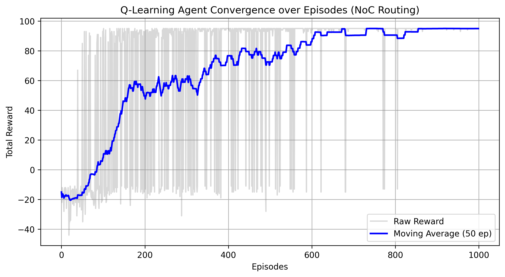

# Intelligent NoC Routing with Q-Learning 

본 프로젝트는 차세대 통신망 및 NoC(Network-on-Chip) 환경에서 발생하는 트래픽 혼잡을 회피하고 최적의 데이터 전송 경로를 탐색하는 지능형 라우팅 에이전트(Intelligent Routing Agent)를 Q-Learning 기반으로 구현한 연구.

# Project Overview
*   목적: 동적 네트워크 환경에서 패킷 손실(Drop)을 방지하고 최소 홉(Minimum Hop)으로 목적지에 도달하기 위한 가치 기반(Value-based) 강화학습 라우팅 알고리즘 검증
*   통신 환경: 트래픽 혼잡 구역(Congestion)이 존재하는 4x4 Grid Network 기반의 Custom Environment 직접 설계
*   핵심 기술: Q-Learning, Markov Decision Process (MDP), Epsilon-Greedy Policy, Python, NumPy, Matplotlib

## 📂 Repository Structure
코드의 재사용성과 알고리즘 평가의 용이성을 위해 환경 정의, 학습 로직, 시각화 모듈을 분리하여 설계.

| File Name | Description |

| [`noc_env.py`](./noc_env.py) | NoC 트래픽 상황을 추상화한 Custom 환경 (State, Action, Reward의 수학적 정의) |
| [`agent.py`](./agent.py) | 상태-행동 가치 함수(Q-Table) 업데이트 및 Epsilon-Greedy 기반 최적 경로 탐색 모듈 |
| [`visualize.py`](./visualize.py) | 학습 수렴성(Convergence) 검증을 위한 보상 데이터 추출 및 Learning Curve 시각화 스크립트 |

# Environment & How to Run
*   Language: Python 3.12
*   Dependencies: NumPy, Matplotlib
*   Execution:
    ```bash
    # 1. Repository Clone
    git clone [https://github.com/본인아이디/Q-Learning-NoC-Routing.git](https://github.com/본인아이디/Q-Learning-NoC-Routing.git)
    cd Q-Learning-NoC-Routing
    
    # 2. 모델 학습 및 결정론적(Deterministic) 최적 경로 탐색 텍스트 결과 확인
    python agent.py
    
    # 3. 에이전트 학습 곡선(Learning Curve) 시각화 데이터 도출
    python visualize.py
    ```

# Mathematical Modeling & Reward Design (MDP)
실제 통신 네트워크의 물리적 특성과 트래픽 지연(Latency) 요소를 반영하여 다음과 같이 정교한 보상(Reward) 함수를 설계.

1.  목적지 도달 (Goal): `+100` (통신 성공 및 에피소드 종료)
2.  혼잡 구역 진입 (Congestion/Drop):** `-10` (치명적인 패킷 손실 페널티 부여 및 에피소드 종료)
3.  1 홉(Hop) 이동: `-1` (네트워크 지연 시간 최소화 및 최단 경로(Minimum Hop) 탐색 유도용 Negative Reward)

# Results (Routing Optimization & Convergence)
학습 초기에는 에이전트의 무작위 탐험(Exploration)으로 인해 잦은 통신 단절(Packet Drop)이 발생하나, 에피소드가 진행될수록 시간차 제어(Temporal Difference Control) 연산을 통해 획득하는 평균 보상(Moving Average)이 가파르게 상승하여 안정적으로 수렴함을 시각화.



1,000 에피소드의 학습이 완료된 후, 에이전트는 완성된 Q-Table을 기반으로 혼잡 구역을 완벽히 우회하여 정확히 6 Hop 만에 목적지에 도달하는 능동적 경로 탐색 능력을 입증.

# Future Work
*   단일 에이전트(Single-Agent) 기반의 Q-Learning 모델을 심층 강화학습인 DQN (Deep Q-Network) 알고리즘으로 확장하여 대규모 네트워크 토폴로지에 적용할 계획.
*   다수의 라우터 노드가 협력하여 네트워크 전역의 트래픽을 분산시키는 연합 강화학습(Federated Reinforcement Learning) 연구로 발전시킬 예정.
